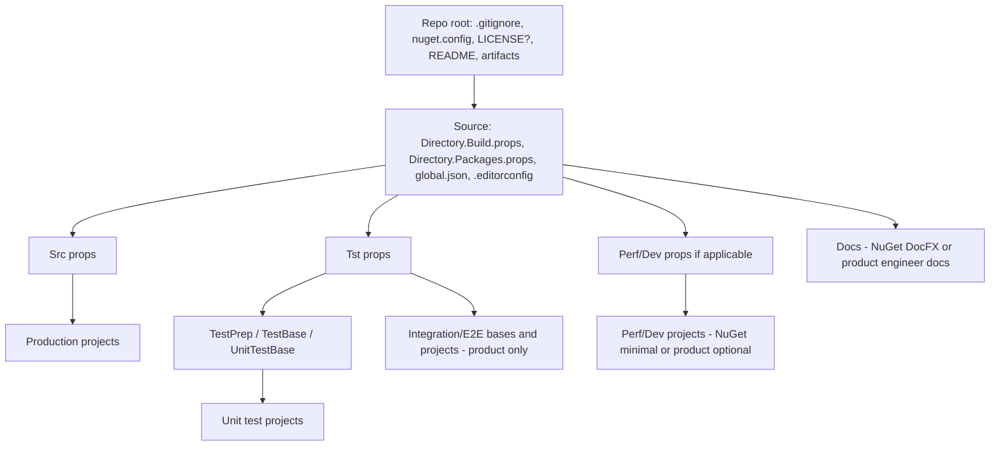

# Common Project Structure — Feature Specification

## 1. Overview and Goals

**Summary:** Define a general-purpose specification for setting up common project structures so that new projects (or existing ones being aligned) can get up and running quickly with a consistent layout, configuration, and administrative footprint. This spec is intended to be used by Cursor agents to create **project-specific plans**; those plans are then executed by other agents to perform the actual setup.

**Success criteria:**

- A plan-building agent can take this spec plus the current state of a project (e.g. a VS solution and its folders) and produce a phased plan.
- An implementing agent can execute plan phases to create or adapt the repository so that it matches the standard structure where applicable.
- The result supports two project types: **public NuGet (open-source)** and **product (internal/product)**.
- When project type is not specified, the plan-building agent **must clarify** with the user whether the project is a public NuGet project or a product project before creating the plan.

**Reference implementation:** The layout and patterns in **KZDev.PerfUtils** (`e:\GitHub\kzdev-net\PerfUtils\KZDev.PerfUtils`) are the standard. Product projects may have additional or more sophisticated test layers (e.g. integration, E2E, component); **Inventar** (`e:\GitHub\kzehrer\Inventar\Inventar`) is cited as an example of a product project with a richer test structure.

---

## 2. Current State (What Exists)

### 2.1 Reference: KZDev.PerfUtils

- **Repo root:** `.github/`, `artifacts/`, `Source/`, `.gitignore`, `KZDev.PerfUtils.code-workspace` (optional per spec), `LICENSE`, `nuget.config`, `README.md`.
- **Source/** (solution root): `Directory.Build.props`, `Directory.Packages.props`, `global.json`, `.editorconfig`, `KZDev.PerfUtils.sln`. Solution items link to repo-root files (e.g. `..\.gitignore`, `..\LICENSE`, `..\nuget.config`, `..\README.md`) and to these config files.
- **MSBuild:** Central Package Management (`ManagePackageVersionsCentrally`), `UseArtifactsOutput` with `ArtifactsPath` = `$(MSBuildThisFileDirectory)..\artifacts` (i.e. repo-root `artifacts/`). Configurations include Debug, Release, Package and Profile where applicable.
- **Src/:** Production projects. Own `Directory.Build.props` (imports parent; adds Package config, TargetFrameworks, Version, Authors, Copyright, GenerateDocumentationFile, IsPacking) and `Directory.Packages.props` (imports parent; source-specific package versions).
- **Tst/:** Test projects. Own `Directory.Build.props` (Configurations Debug|Release, TargetFrameworks, IsPackable false, RootNamespace, ExcludeFromCodeCoverage) and `Directory.Packages.props` (imports parent; test package versions, including TF-specific). Test hierarchy: **UnitTestBase** → **TestBase** → **TestPrep**; unit test projects reference main library and UnitTestBase; shared test code via **.shproj** and **.projitems**. Optional `linuxtest.dockerfile (for nuget package projects)`, `Tst\README.md`.
- **Perf/:** Benchmark projects. Own `Directory.Build.props` (imports parent; Profile config, net9|net8, IsPackable false) and `Directory.Packages.props`. For NuGet projects this folder is always present (may be minimal). This folder does not exist for product projects.
- **Dev/:** Development/example projects (e.g. Examples). For NuGet projects this folder is always present (may be minimal). This folder does not exist for product projects.
- **Docs/:** Documentation. For **public NuGet:** docfx layout (`docfx.json`, `filterConfig.yml`, `index.md`, `toc.yml`, `articles/`, `api/`, `images/`, `templates/`), `Docs\.gitignore` for `_site/`, `api/`. For **product:** Docs folder exists for engineers and AI agents; no DocFX structure or published docs required.
- **Notes/:** e.g. `ReleaseNotes.md`; optional or minimal as needed.
- **NuGet-specific (PerfUtils):** `nuget.config` (clear + nuget.org); main library Package* properties, icon/readme under `Package/`, snupkg, RepositoryUrl, MIT; `.github/workflows/docfx-publish.yml` for build + docfx + GitHub Pages.

### 2.2 Example: Product project (Inventar)

- **Inventar** uses `Source/` with `Src/` and `Tst/`. Test area includes **UnitTestBase**, **TestBase**, **TestCore**, **IntegrationTestBase**, **E2ETestBase**, **ComponentTestBase (for products with Blazor front-ends)**, and domain-specific bases (e.g. **CosmosDb.IntegrationTestBase**). Integration and E2E test projects are more numerous and sophisticated than in a typical library repo. This illustrates that product projects share the same basic layout and test patterns but may have a richer test hierarchy and integration/E2E coverage.

### 2.3 Applying to an existing project

- When this spec is used to create a plan for an **existing** repo, the plan-building agent will inventory that project’s current layout (solution location, folders under the solution root, existing config files, naming). The plan will then add or adapt structure per this spec without renaming existing folders; only newly created folders use the standard names (Source, Src, Tst, Perf, Dev, Docs, Notes). The spec does not name a specific target project; any repo can be the subject of a derived plan.

---

## 3. Gaps (What Does Not Yet Exist)

- A single, authoritative spec document that captures the common structure and the NuGet vs product distinctions.
- Explicit instructions for plan-building agents to clarify project type when not specified.
- Documented policy for applying the spec to **existing** projects: adapt to existing names/paths where they differ; use standard names only for **new** folders and files.
- Documented choices: Perf/Dev always present for NuGet (possibly minimal); Docs for product = engineer/agent docs only (no DocFX); optional .code-workspace; no CI required for product; test stack and naming standard; artifacts required; LICENSE optional for product.
- Reference to AwesomeAssertions as the preferred assertion library going forward (replacing FluentAssertions where new work is done).

---

## 4. Changes Required (What to Modify, Enhance, or Extend)

When creating a **plan** from this spec, the plan must:

1. **Clarify project type** if not specified: public NuGet vs product. Do not assume.
2. **Inventory current state** of the target repo (solution file, folders under Source or equivalent, existing .gitignore, nuget.config, Directory.Build.props, etc.).
3. **Apply naming/layout rules:**
  - **New** folders and files: use standard names (Source, Src, Tst, Perf, Dev, Docs, Notes as applicable).
  - **Existing** folders that differ (e.g. "Tests" instead of "Tst"): do not rename; adapt the plan to the existing names and use the standard only for newly added siblings or content.
4. **Define phases** that introduce or adjust:
  - Repo root: .gitignore, nuget.config, LICENSE (required for NuGet; optional for product), README.md, artifacts (via MSBuild).
  - Source-level: Directory.Build.props (solution-level), Directory.Packages.props, global.json, .editorconfig, solution items.
  - Src: Directory.Build.props, Directory.Packages.props, production projects.
  - Tst (or existing test folder): Directory.Build.props, Directory.Packages.props, test hierarchy (UnitTestBase → TestBase → TestPrep; shared .shproj where needed); for product, allow for IntegrationTestBase, E2ETestBase, etc., as in Inventar.
  - Perf, Dev: for NuGet, always present (may be minimal); for product, optional.
  - Docs: for NuGet, full DocFX structure and optional publish workflow; for product, Docs folder for engineer/agent docs, no DocFX requirement.
  - .github: for NuGet, docfx/publish workflow as needed; for product, CI workflows are not required by this spec.
5. **Preserve** existing behavior and project identities; only add or reorganize as needed to satisfy the spec.

No direct changes to production or test **code** are in scope; only structure, configuration, and administrative files.

---

## 5. Dependencies

### 5.1 Change dependencies (order of work)

- Repo root and Source-level config (Directory.Build.props, Directory.Packages.props, global.json, .editorconfig) should be in place before or in parallel with folder-specific props.
- Src/Directory.Build.props and Directory.Packages.props depend on Source-level props.
- Tst and Perf/Dev Directory.Build.props and Directory.Packages.props depend on Source-level props.
- Test base projects (TestPrep → TestBase → UnitTestBase) must be created before unit test projects that reference them.
- Docs structure (if NuGet) can be added after the solution and build are stable.

### 5.2 Existing dependencies

- Visual Studio / .NET SDK and MSBuild for Directory.Build.props and Central Package Management.
- For NuGet: docfx for Docs; GitHub Actions (or equivalent) for docfx publish if desired.
- For tests: xUnit (v3), supporting packages (Moq, AutoFixture, etc.); **AwesomeAssertions** preferred for new work over FluentAssertions.

### 5.3 New dependencies

- None beyond tooling already implied (SDK, docfx for NuGet docs). The spec does not introduce new external systems.

---

## 6. Research and Discovery

- **KZDev.PerfUtils** was inspected in full: repo root, Source layout, Src/Tst/Perf/Dev/Docs/Notes, all Directory.Build.props and Directory.Packages.props, .editorconfig, docfx.json, solution structure, test project chain (UnitTestBase → TestBase → TestPrep), shared .shproj usage, nuget.config, LICENSE (MIT), README, and .github workflow.
- **KZDev.PrimeTime** solution and current layout were reviewed for alignment goals.
- **Inventar** product project was sampled: Source with Src/Tst, artifacts, docs; test projects include UnitTestBase, TestBase, TestCore, IntegrationTestBase, E2ETestBase, ComponentTestBase, CosmosDb.IntegrationTestBase, and multiple *IntegrationTests/*E2ETests/*ComponentTests projects.
- **User answers** (incorporated):
  - NuGet: Perf and Dev folders always present (may be empty/minimal).
  - Product: Docs folder for engineers and AI agents; no DocFX or published docs required.
  - .code-workspace optional.
  - CI not required for product projects.
  - Same test framework and layout (Unit vs Integration), test class hierarchy; move to AwesomeAssertions; product integration tests can be much more sophisticated (Inventar as example).
  - UseArtifactsOutput with repo-root artifacts/ required.
  - LICENSE optional for product.
  - Same structure and names everywhere; when applying to existing projects that don’t match, adapt to what exists and use standard names only for new folders.

---

## 7. Out of Scope

- Implementing application or library **features** (only structure and config).
- Choosing or changing the **test framework** for a project that already standardizes on something else (beyond the stated standard: xUnit, same layout and hierarchy, AwesomeAssertions preferred).
- Renaming **existing** folders or solution names to match the spec when the project already uses different names; only new elements use standard names.
- Mandating **.github** workflows for product projects.
- Defining the contents of **specs/** or other planning artifacts beyond the fact that this spec lives under `specs/` and drives plan creation.
- DocFX content authoring or API filter tuning; only the presence and shape of the Docs folder and (for NuGet) DocFX config are in scope.

---

## 8. Project Type Clarification (Required for Plans)

When an agent creates a plan from this spec, it **must** determine project type. If the user has not specified:

- **Public NuGet (open-source):** e.g. publishable package, LICENSE (e.g. MIT), README, nuget.config, DocFX docs, optional GitHub Pages workflow, Perf/Dev folders always present.
- **Product:** internal or product repo; Docs for engineers/agents only (no DocFX); LICENSE optional; CI optional; Perf/Dev optional; integration/E2E tests may be extensive.

The plan-building agent **must ask the user** to confirm which type applies (or to specify exceptions) before producing the plan. The plan shall then reference this spec and the chosen project type and list which sections apply (e.g. “NuGet: DocFX + Perf + Dev required” vs “Product: Docs folder only, Perf/Dev optional”).

---

## 9. Standard Names and Layout Summary

| Element            | Standard name / location         | NuGet                    | Product                  | Notes                                            |
| ------------------ | -------------------------------- | ------------------------ | ------------------------ | ------------------------------------------------ |
| Solution root      | `Source/`                        | Yes                      | Yes                      | Where the .sln lives.                            |
| Production code    | `Source/Src/`                    | Yes                      | Yes                      | Directory.Build.props, Directory.Packages.props. |
| Tests              | `Source/Tst/`                    | Yes                      | Yes                      | If existing folder has another name, keep it.    |
| Benchmarks         | `Source/Perf/`                   | Yes (may be minimal)     | Optional                 |                                                  |
| Examples / dev     | `Source/Dev/`                    | Yes (may be minimal)     | Optional                 |                                                  |
| Documentation      | `Source/Docs/`                   | DocFX + publish optional | Engineer/agent docs only | No DocFX for product.                            |
| Release notes etc. | `Source/Notes/`                  | Optional                 | Optional                 |                                                  |
| Build output       | `artifacts/` (repo root)         | Yes (UseArtifactsOutput) | Yes                      |                                                  |
| Repo root          | .gitignore, nuget.config, README | Yes                      | Yes                      |                                                  |
| LICENSE            | Repo root                        | Required                 | Optional                 |                                                  |
| .code-workspace    | Repo root                        | Optional                 | Optional                 |                                                  |
| .github workflows  | Repo root                        | Optional (e.g. docfx)    | Not required             |                                                  |

---

## 10. Test Stack and Layout (Common)

- **Framework:** xUnit (v3 where applicable). Supporting packages: Moq, AutoFixture, etc. **Assertions:** prefer **AwesomeAssertions** for new work; FluentAssertions may remain in existing projects.
- **Layout:** Unit vs Integration (and E2E/component for product). Test hierarchy: base projects (e.g. TestPrep → TestBase → UnitTestBase; for product, add IntegrationTestBase, E2ETestBase, etc.). Shared test code via shared projects (.shproj + .projitems).
- **Product:** Integration and E2E test structure can be much more sophisticated (see Inventar: IntegrationTestBase, E2ETestBase, ComponentTestBase, domain-specific integration bases and many *IntegrationTests/*E2ETests projects).

---

## 11. For AI Agents

- **Plan-building agent:** Given this spec and the current state of a project (e.g. solution path, existing folders): (1) If project type (public NuGet vs product) is not stated, ask the user before proceeding. (2) Inventory the repo (solution, folders, existing config files). (3) Produce a phased plan that creates or adapts structure per §4 and §9; use standard names only for **new** folders; leave existing non-standard names unchanged. (4) Emit the plan (e.g. in a plan file or structured message) for an implementing agent.
- **Implementing agent:** Given a plan derived from this spec: execute phases in order; do not rename existing folders to match the spec; add only what the plan specifies. Do not implement application or library features—only structure, MSBuild/config, and administrative files.

---

## 12. Open Questions

- None at spec publication; any open points discovered during plan creation or execution should be resolved with the user and reflected in the plan or a spec update.

