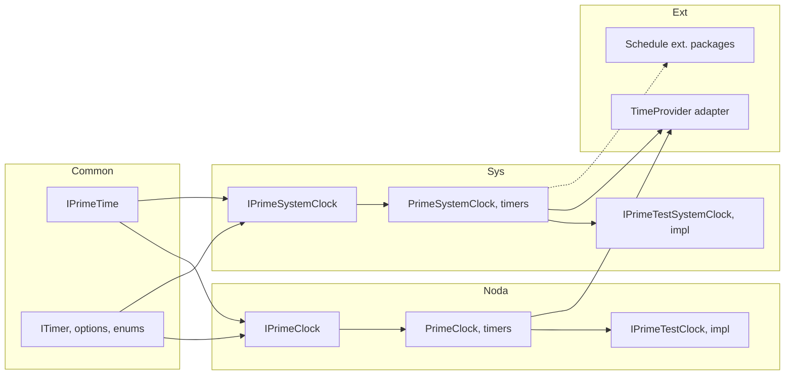

# PrimeTime Library — Implementation Specification

## 1. Overview and Goals

**Summary:** Revive and fully implement the KZDev.PrimeTime open-source NuGet package (public API namespace: **KZDev.PrimeTime**): a general-purpose time management library that supports both **NodaTime** (Instant, Duration) and **BCL/system** (DateTimeOffset, TimeSpan) time representations. The library must provide delays (Sleep, Task.Delay), time-based cancellation tokens, interval and schedule-based timers (including cron) with configurable callback timing (from previous callback start vs. end), and both sync and async callbacks. It must integrate with **Microsoft’s TimeProvider and ITimer** (where applicable) and offer a **test/time-controllable** implementation for deterministic unit and integration tests.

**Success criteria:**

- Single library surface that supports NodaTime and system clock usage without forcing a choice at the call site when both are needed.
- All time-based operations (Sleep, Delay, timers, time cancellation) go through injectable clock/time abstractions so production and tests use the same API.
- Timer “next tick” is configurable: from previous callback **start** or from previous callback **end** (reset-after-callback).
- Test implementation allows fine-grained control of current time (set, advance, run-for, start/stop with optional rate) so tests are deterministic.
- Where .NET supports it, functionality is available via or compatible with `TimeProvider`/`ITimer` so existing code using those abstractions can adopt PrimeTime or interoperate.

---

## 2. Current State (What Exists)

### 2.1 KZDev.PrimeTime (target repo)

- **Location:** `e:\GitHub\kzdev-net\PrimeTime\KZDev.PrimeTime`
- **Solution:** `Source\KZDev.PrimeTime.sln` with:
  - **Production:** `KZDev.PrimeTime`, `KZDev.PrimeTime.SystemClock`, `KZDev.PrimeTime.NodaTime`
  - **Shared:** `KZDev.PrimeTime.Common.Shared` (shared project)
  - **Tests:** Solution folders for Tests, FrameworkTests, StandardTests (no test projects implied in the provided tree)
- **Implemented:** Only one contract file is present:
  - `Source\Src\Shared\KZDev.PrimeTime.Common.Shared\Contracts\IPrimeTime.cs` — matches the original `IPrimeTime`: Sleep (TimeSpan/int), DelayAsync (TimeSpan/int, with/without CancellationToken), GetTimeCancellationToken, LinkTimeCancellationToken (multiple overloads).
- **Not present:** No other interfaces, models, enums, or implementations; no NodaTime or SystemClock-specific APIs; no timers; no test clocks; no TimeProvider integration.

### 2.2 Original PrimeTime/Clock project (reference)

- **Location:** `E:\Kevin\Git\Clock\src` (and tests under `E:\Kevin\Git\Clock\test`).
- **Contracts (concepts to carry over):**
  - **Common:** `IPrimeTime`, `ITimer`, `IDayTimeTimer`, `IIntervalTimer`; `TimerOptions`, `IntervalTimerOptions`, `DayTimeTimerOptions`; `TimerState`; `ConcurrentTriggerProcessing`, `SkippedTimeBehavior`, `DuplicateTimeBehavior`; time-of-day types (e.g. `LocalTimeOfDay`/`UtcTimeOfDay` in SystemClock, NodaTime `LocalTime`).
  - **NodaTime:** `IPrimeClock` (extends IPrimeTime; Instant, LocalDateTime, ZonedDateTime, LocalTime, LocalDate; Sleep(Duration), DelayAsync(Duration), time cancellation with Duration; many `RegisterTimer`/`RegisterTimeOfDay` overloads with Action/Func and state, sync/async); `IPrimeClockTimerRegistration` (extends ITimer; Change(LocalTime), Change(Duration), Change(Duration, Duration)).
  - **SystemClock:** `IPrimeSystemClock` (extends IPrimeTime; DateTimeOffset/DateTime/TimeOnly/DateOnly for now; `RegisterTimer`/`RegisterAsyncTimer` with TimeSpan, state, `ClockTimerCallbackContext`; `RegisterTimeOfDay`/`RegisterAsyncTimeOfDay` for LocalTimeOfDay/UtcTimeOfDay); `IClockTimer`, `IClockIntervalTimer` (Change(TimeSpan), Change(TimeSpan, TimeSpan)), `IClockDayTimeTimer`; `IntervalTimerOptions`, `DayTimeTimerOptions`.
  - **Testing:** `IPrimeTestTime` (IPrimeTime + IsRunning); `IPrimeTestClock` (IPrimeTestTime + IPrimeClock; ClockEvents, SetInstant, SetTime, SetLocalTime, Advance(Duration), RunFor, Start/Stop); `IPrimeTestSystemClock` (IPrimeTestTime + IPrimeSystemClock; ClockEvents, SetTime, Advance(TimeSpan), RunFor, Start/Stop returning bool).
- **Implementations (reference only):** Clock project contains implementations (e.g. `PrimeClock`, `PrimeSystemClock`, `PrimeTestClock`, `PrimeTestSystemClock`, interval/day-time timer classes). These are in a different repo and are not copied into KZDev.PrimeTime; the spec assumes re-implementation in the target repo following the same contracts and behaviors.

### 2.3 TPRoot / E3Retail.System (inspiration)

- **Location:** `E:\E3Git\Cloud\Arch.MainMerge\Dev\Domain\System\Core\TPRoot\Src`
- **Contracts:** `ISystemClock` (SubscribeCallback, SubscribeRepeatingCallback, SubscribeUnsafeCallback, SubscribeServiceRequestCallback, day-time and cron-style; Now, LocalNow, UtcNow; Sleep, DelayAsync, GetTimeCancellationToken, LinkTimeCancellationToken); `IClockSubscription` (IsCancelled, IsTimeOfDay, IsRepeating, Change(TimeSpan)); `ITestSystemClock` (extends ISystemClock; ClockEvents, SetTime, SetLocalTime, Advance, RunFor, Start/Stop).
- **Implementations:** `SystemClock`, `TestSystemClock`, `DayClockTimer`, `ClockTimer`; **SystemClockExtensions** with cron (Cronos) via `SubscribeCronScheduleCallback` and service-request variants (lastRunTime, allowedLateRunTime).
- **Relevance:** PrimeTime is a superset: same ideas (repeat from start vs. after callback, day-time, cron) but with a cleaner dual-stack (NodaTime + BCL), richer timer options (ConcurrentTriggerProcessing, SkippedTimeBehavior, DuplicateTimeBehavior), and explicit test clock control. TPRoot’s “service request” and “scope name” concepts are **out of scope** unless explicitly reintroduced (see Out of scope).

---

## 3. Gaps (What Does Not Yet Exist in KZDev.PrimeTime)

- **Common layer:** `ITimer`, `IDayTimeTimer`, `IIntervalTimer`; `TimerState`; `TimerOptions`, `IntervalTimerOptions`, `DayTimeTimerOptions`; enums `ConcurrentTriggerProcessing`, `SkippedTimeBehavior`, `DuplicateTimeBehavior`; any shared callback-context or time-of-day value types used by both stacks.
- **NodaTime stack:** `IPrimeClock`, `IPrimeClockTimerRegistration`; NodaTime-based implementations of delays, time cancellation, interval timers, time-of-day timers; production and test implementations.
- **SystemClock stack:** `IPrimeSystemClock`, `IClockTimer`, `IClockIntervalTimer`, `IClockDayTimeTimer`; BCL time-of-day types (e.g. LocalTimeOfDay, UtcTimeOfDay) and callback context; implementations for production and test.
- **Testing:** `IPrimeTestTime`, `IPrimeTestClock`, `IPrimeTestSystemClock`; test implementations with SetTime/SetInstant, Advance, RunFor, Start/Stop, optional rate, and observable events so tests can drive time precisely.
- **TimeProvider/ITimer integration:** Adapters or wrappers so that:
  - PrimeTime clocks can be backed by or expose a `TimeProvider` (where the platform supports it), and/or
  - PrimeTime timers/delays can use `TimeProvider`/`ITimer` internally when available, with the test clock providing a custom `TimeProvider` for tests.
- **Schedule-based (cron) timers:** Not in the initial core package; planned as **optional extension packages** (e.g. Cronos, Hangfire, Quartz.NET) in follow-up work. Architecture must support extension points so these can plug in without coupling core to a specific scheduler library.
- **Implementations:** All production and test implementations for the above; no implementations exist in the target repo today.

---

## 4. Changes Required (What to Modify, Add, or Extend)

### 4.1 KZDev.PrimeTime.Common.Shared

- **Add (new):**
  - `ITimer` (registration: Id, IsCancelled, IsTimeOfDay, IsRepeating, IsLocalTimeRepresentation, IsActive, State, CallbacksProcessing, Enabled, Cancel, Stop, Start).
  - `IDayTimeTimer` (extends ITimer; ConcurrentTriggerProcessing, SkippedTimeBehavior, DuplicateTimeBehavior).
  - `IIntervalTimer` (extends ITimer; IsResetAfterCallback, ElapsedTime, TimeUntilNextCallback).
  - `TimerState` enum (Active, Cancelled, Completed, Disabled, Disposed, ProcessingCallback, RepeatCycle, RepeatProcessingCallback).
  - `TimerOptions` (e.g. LocalTimeRepresentation); `IntervalTimerOptions` (ResetIntervalAfterCallback); `DayTimeTimerOptions` (ConcurrentTriggerProcessing, SkippedTimeBehavior, DuplicateTimeBehavior).
  - Enums: `ConcurrentTriggerProcessing`, `SkippedTimeBehavior`, `DuplicateTimeBehavior`.
  - Any shared types needed by both NodaTime and SystemClock (e.g. callback context base or interfaces) without tying to a specific time type.
  - Option or enum to control **execution context capture** for timer callbacks (e.g. capture vs. suppress / “Unsafe”) so both stacks can offer the same behavior.
- **Modify:** None required; `IPrimeTime` is already present and remains the base for “time passing” and cancellation.

### 4.2 KZDev.PrimeTime (main package)

- **Add:**
  - Facade or registration that exposes the chosen default clock (system vs. NodaTime) if the main package is to provide a single entry point; otherwise the main package may only reference Common and the two stacks (NodaTime and SystemClock) and leave clock selection to the host.
  - Any shared utilities or extensions that apply to both stacks and belong in the main project rather than Common.

### 4.3 KZDev.PrimeTime.NodaTime

- **Add:**
  - `IPrimeClock` extending `IPrimeTime` with NodaTime now types (Instant, LocalNow, UtcNow, LocalZonedNow, UtcZonedNow, LocalNowTime, UtcNowTime, LocalNowDate, UtcNowDate); Sleep(Duration), DelayAsync(Duration[, CancellationToken]); GetTimeCancellationToken(Duration), LinkTimeCancellationToken(Duration, …); full set of RegisterTimer and RegisterTimeOfDay overloads (sync/async, with/without state, with/without registration in callback); **async callbacks return ValueTask**. `IPrimeClockTimerRegistration` (Change(LocalTime), Change(Duration), Change(Duration, Duration)).
  - Timer registration overloads that accept an option to **suppress execution context capture** (Unsafe).
  - `IPrimeClockTimerRegistration` extending `ITimer` (or the common registration interface name used in this repo).
  - Production implementation of `IPrimeClock` (e.g. `PrimeClock`) using NodaTime’s `IClock`/system clock.
  - Test implementation of `IPrimeClock` implementing `IPrimeTestClock` (SetInstant, SetTime, SetLocalTime, Advance(Duration), RunFor, Start(Duration?), Stop, ClockEvents).
  - NodaTime-based implementations of delays and time cancellation using the clock abstraction.

### 4.4 KZDev.PrimeTime.SystemClock

- **Add:**
  - `IPrimeSystemClock` extending `IPrimeTime` with BCL now types (LocalNow, UtcNow, LocalDateTimeNow, UtcDateTimeNow, LocalNowTime, UtcNowTime, LocalNowDate, UtcNowDate); RegisterTimer/RegisterAsyncTimer returning `IClockIntervalTimer` (async callbacks return **ValueTask**); RegisterTimeOfDay/RegisterAsyncTimeOfDay for local and UTC time-of-day returning a timer type that implements `IClockDayTimeTimer` where applicable.
  - `IClockTimer` (extends ITimer; RegisteredTime); `IClockIntervalTimer` (extends IIntervalTimer, IClockTimer; Change(TimeSpan), Change(TimeSpan, TimeSpan)); `IClockDayTimeTimer` (extends IDayTimeTimer, IClockTimer).
  - **Time-of-day types:** `LocalTimeOfDay` and `UtcTimeOfDay` in the SystemClock assembly — **TimeOnly wrappers** with semantic meaning (local vs. UTC time of day).
  - Callback context type (e.g. `ClockTimerCallbackContext`) for callbacks that receive state, registration, and/or CancellationToken.
  - Timer registration overloads that accept an option to **suppress execution context capture** (Unsafe) so callbacks run without capturing/restoring the calling context.
  - Production implementation of `IPrimeSystemClock`.
  - Test implementation implementing `IPrimeTestSystemClock` (SetTime, Advance(TimeSpan), RunFor, Start/Stop with optional rate, ClockEvents).
  - SystemClock implementations of Sleep, DelayAsync, and time cancellation using the clock abstraction.

### 4.5 TimeProvider / ITimer integration

- **Add:**
  - Where target frameworks support `TimeProvider` (e.g. .NET 8+ or via Microsoft.Bcl.TimeProvider package): implement or wrap PrimeTime’s delay/timer behavior using `TimeProvider` (e.g. GetUtcNow, CreateTimer) so that code depending on `TimeProvider`/`ITimer` can use the same time source.
  - A test `TimeProvider` (or adapter to `FakeTimeProvider` if using Microsoft.Extensions.Time.Testing) that is driven by the PrimeTime test clock (SetTime, Advance, etc.) so that any functionality built on TimeProvider is also controllable in tests.
  - Document how to obtain a `TimeProvider` from a PrimeTime clock when available (adapter interface or extension method).

### 4.6 Schedule-based (cron) timers — optional extensions (follow-up)

- **Out of initial scope; architecture only:** Schedule-based timers (cron, etc.) are **not** in the core package. Plan for **optional extension packages** (e.g. KZDev.PrimeTime.SystemClock.Extensions.Cronos, Hangfire, Quartz.NET) as follow-up. The core design should **keep extension in mind**: e.g. a clock interface that allows “schedule next callback at time X” so extension packages can compute the next occurrence (from cron/Hangfire/Quartz) and register a one-shot timer, then reschedule on fire. No cron (or other scheduler) dependency in the core SystemClock or NodaTime packages.

### 4.7 Testing projects

- **Add:**
  - Test projects (e.g. under Tests/FrameworkTests or StandardTests) that reference the test clock implementations and verify: Sleep, DelayAsync, time cancellation, interval timers (reset from start vs. from end), time-of-day timers, and test clock advance/run-for/start-stop behavior. No test implementation exists in the target repo today.

---

## 5. Dependencies

### 5.1 Change dependencies (order of work)

- **Common first:** All contracts and enums in Common (ITimer, IDayTimeTimer, IIntervalTimer, TimerState, TimerOptions, IntervalTimerOptions, DayTimeTimerOptions, enums) must be in place before NodaTime and SystemClock timer APIs can be implemented.
- **Clocks after Common:** IPrimeTime is already present; IPrimeClock and IPrimeSystemClock extend it and add timer registration. Implementations of delays and time cancellation can be done as soon as the clock interfaces (or a minimal “time source” abstraction) exist.
- **Timer registrations after clock interfaces:** RegisterTimer/RegisterTimeOfDay and their return types (IPrimeClockTimerRegistration, IClockIntervalTimer, IClockDayTimeTimer) depend on ITimer and the option types from Common.
- **Test clocks after production clocks:** Test interfaces and implementations depend on the production clock interfaces and timer registration behavior.
- **TimeProvider integration after production clocks:** Adapters or wrappers that expose or use TimeProvider depend on having a working clock and timer implementation.
- **Schedule extensions (follow-up):** Optional cron/scheduler extension packages depend on the core clock and interval/one-shot timer APIs; architecture should allow them to plug in without adding scheduler dependencies to core.

### 5.2 Existing dependencies (constraints)

- **NodaTime:** NodaTime package is required for the NodaTime stack (Instant, Duration, LocalTime, LocalDateTime, ZonedDateTime, IClock). The target solution already has a KZDev.PrimeTime.NodaTime project.
- **Target frameworks:** Current projects support net6.0, net8.0, net9.0, netstandard2.0 (from obj folders). TimeProvider is in .NET 8+ and available via package for older targets; implementation may use conditional compilation or multi-targeting.
- **Shared project:** KZDev.PrimeTime.Common.Shared is a shared project (shproj); all consuming projects must reference it. No new package dependency in Common except what is needed for the contract signatures (e.g. NodaTime types only in the NodaTime assembly, not in Common).

### 5.3 New dependencies (to introduce)

- **NodaTime:** Already expected for the NodaTime project.
- **TimeProvider:** For .NET 8+, use the built-in `System.TimeProvider` and `System.Threading.ITimer`. For older targets, consider `Microsoft.Bcl.TimeProvider` if the library should support TimeProvider there.
- **Cron/schedulers:** Not in core. Optional extension packages (e.g. Cronos, Hangfire, Quartz.NET) will add their own dependencies when implemented as follow-up.
- **Testing (optional):** `Microsoft.Extensions.Time.Testing` (FakeTimeProvider) if the test clock is implemented by wrapping or aligning with it; otherwise no hard dependency for the core test clock implementation.

---

## 6. Research and Discovery

### 6.1 Source references

| Area | Location (original/reference) |
|------|-------------------------------|
| IPrimeTime, ITimer, IDayTimeTimer, IIntervalTimer | Clock: PrimeTime.Common.Shared/Contracts |
| TimerOptions, IntervalTimerOptions, DayTimeTimerOptions | Clock: PrimeTime.Common.Shared/Models |
| TimerState, enums | Clock: PrimeTime.Common.Shared |
| IPrimeClock, IPrimeClockTimerRegistration | Clock: PrimeTime.NodaTime.Shared/Contracts |
| IPrimeSystemClock, IClockTimer, IClockIntervalTimer, IClockDayTimeTimer | Clock: PrimeTime.SystemClock.Shared/Contracts |
| IPrimeTestTime, IPrimeTestClock, IPrimeTestSystemClock | Clock: PrimeTime.*.Testing.Shared/Contracts |
| ISystemClock, IClockSubscription, ITestSystemClock | TPRoot: E3Retail.System.Contracts.Shared, TestSupport |
| SystemClock, TestSystemClock, DayClockTimer, ClockTimer | TPRoot: E3Retail.System.Service |
| Cron extensions | TPRoot: SystemClockExtensions (Cronos) |

### 6.2 Microsoft TimeProvider / ITimer

- **TimeProvider** (e.g. .NET 8): Provides `GetUtcNow()`, `GetLocalNow()`, `GetTimestamp()`, `GetElapsedTime()`, `CreateTimer()` (returns `ITimer`), and `LocalTimeZone`. Used for testable time and timers in the BCL and in libraries (e.g. HttpClient, Polly).
- **ITimer:** Created by `TimeProvider.CreateTimer`; supports dueTime, period, and callback; can be changed/disposed. PrimeTime’s richer timer model (reset-after-callback, day-time, cron) sits above or alongside this: either use `TimeProvider`/`ITimer` internally where it fits, or expose a way to get a `TimeProvider` from a PrimeTime clock so that components using `TimeProvider` see the same (possibly test) time.

### 6.3 Assumptions

- The target repo (KZDev.PrimeTime) is the single source of truth for the revived library; the Clock and TPRoot codebases are reference only and will not be copied verbatim.
- CancellationToken is required on all async methods (per user rules).

### 6.4 Decisions (from interview)

1. **Namespace:** Use **KZDev.PrimeTime** for the main public API (not PrimeTime).
2. **Callback context:** Both stacks use the **same callback shape**. Parameter lists vary by use case as in the referenced interfaces (e.g. no state, state only, state + registration, state + registration + CancellationToken; sync Action vs. async Func returning ValueTask). Follow the existing overload patterns from the reference for consistency.
3. **Time-of-day types (SystemClock):** **LocalTimeOfDay** and **UtcTimeOfDay** live in the **SystemClock** assembly. They are **TimeOnly wrappers** with semantic meaning: one represents local time of day, the other UTC time of day.
4. **Execution context:** **Yes** — include an option to **suppress execution context capture** for timer callbacks (TPRoot’s “Unsafe” style) in the **first version**. Callers can choose whether callback execution captures/restores the calling context or runs without it.
5. **Cron/schedule-based timers:** **Optional extension**, not in the core package. Plan for **multiple extension packages** (e.g. Cronos, Hangfire, Quartz.NET) as follow-up after the initial package is done. **Architecture should keep this in mind** (e.g. extension points, no cron in core SystemClock so optional extensions can plug in).
6. **Async callback return type:** Standardize on **ValueTask** for async timer callbacks in **both** NodaTime and SystemClock stacks.

---

## 7. Development Approach

### 7.1 TDD (test-driven development)

**TDD is required.** Every implementation phase follows the same three sub-phases in order:

1. **Sub-Phase 1 — Contracts:** Implement interfaces, models, contracts, extension points, and any supporting types for the scope of that phase. No production implementation yet; only the API surface and data shapes that the phase covers.

2. **Sub-Phase 2 — Tests:** Write a **comprehensive TDD test suite** for the items introduced in Sub-Phase 1. Tests define the expected behavior and contracts; they may use test doubles or minimal stubs where an implementation does not yet exist. Tests must be sufficient to validate the upcoming implementation.

3. **Sub-Phase 3 — Implementation:** Full implementation of the interfaces and classes for that phase. Implementation is complete when the Sub-Phase 2 test suite passes and behavior matches the spec.

This three-step pattern (contracts → tests → implementation) **repeats for every phase**. No phase skips to implementation without its contract and test sub-phases.

### 7.2 Phase granularity

Phases must be **very granular**, down to the level of each sub-feature. **SystemClock and NodaTime are treated as separate phases** for the same logical feature wherever both stacks provide it.

**Examples of granular phases (for plan-building; not an exhaustive list):**

- **Common:** One or more phases for shared contracts (e.g. ITimer, IDayTimeTimer, IIntervalTimer; TimerState; TimerOptions, IntervalTimerOptions, DayTimeTimerOptions; enums; execution-context option). Each such group can be its own phase with the three sub-phases above.

- **SystemClock — Time & date capture:** One phase for SystemClock “now” as date+time (e.g. LocalNow, UtcNow, LocalDateTimeNow, UtcDateTimeNow).

- **NodaTime (PrimeClock) — Time & date capture:** One phase for PrimeClock “now” as date+time (e.g. LocalNow, UtcNow, LocalZonedNow, UtcZonedNow).

- **SystemClock — Time-only capture:** One phase for SystemClock time-of-day only (e.g. LocalNowTime, UtcNowTime).

- **NodaTime — Time-only capture:** One phase for PrimeClock time-only (e.g. LocalNowTime, UtcNowTime).

- **SystemClock — Date-only capture:** One phase for SystemClock date only (e.g. LocalNowDate, UtcNowDate).

- **NodaTime — Date-only capture:** One phase for PrimeClock date only (e.g. LocalNowDate, UtcNowDate).

- **Delays, time cancellation, interval timers, day-time timers, test clocks, TimeProvider integration:** Similarly, one phase per sub-feature per clock type (e.g. “SystemClock — Sleep and DelayAsync”, “NodaTime — Sleep and DelayAsync”, “SystemClock — interval timers”, “NodaTime — interval timers”, etc.).

An implementation plan derived from this spec must break work into phases at this granularity and apply the three sub-phases (contracts → tests → implementation) to each phase.

---

## 8. Out of Scope

- **TPRoot-specific concepts:** “Service request” scope, correlation vectors, and “scope name” for timer callbacks are out of scope unless explicitly reintroduced in a later spec.
- **Backward compatibility with the old Clock package:** No guarantee that the old Clock package’s assembly or namespace layout is preserved; the target is the KZDev.PrimeTime solution structure.
- **UI or application hosting:** No UI, ASP.NET Core hosting, or job-scheduler UI; the library is a set of contracts and implementations for use in any host.
- **Documentation beyond XML comments:** No separate doc site or markdown API docs are in scope for this spec; XML documentation on public API is expected.
- **Localization:** No localized exception messages or UI; English-only strings are acceptable.

---

## 9. Other Sections

### 9.1 In scope (summary)

- Common contracts and enums (ITimer, IDayTimeTimer, IIntervalTimer, options, TimerState, behavior enums).
- IPrimeClock and IPrimeSystemClock with full timer and time-of-day registration as in the reference; async callbacks use ValueTask; both stacks share the same callback shapes (varied overloads by use case).
- Production and test implementations for both NodaTime and SystemClock.
- Delays (Sleep, DelayAsync), time-based cancellation tokens, interval timers (with reset-from-start vs. reset-from-end), time-of-day timers. Schedule-based (cron) timers are follow-up via optional extension packages; core architecture must support extension.
- Option to suppress execution context capture (Unsafe) for timer callbacks in the first version.
- TimeProvider/ITimer integration where the platform supports it, with test clock providing controllable time for tests.
- Unit/integration tests that validate behavior using the test clocks.

### 9.2 Technical notes

- **Async callback handling:** Repeating timers with “reset after callback” must schedule the next tick only after the async callback completes (or fails); implementors should avoid fire-and-forget that would decouple the next interval from completion.
- **Test clock thread safety:** SetTime, Advance, RunFor, Start, Stop may be called from test code while timer callbacks run; the test clock and its timers should be thread-safe and well-defined under concurrent advance and callback execution.
- **Timer disposal:** All timer registrations are IDisposable; disposing the registration must stop the timer and release resources; behavior after Dispose (e.g. Change, Enable) should be defined (no-op or ObjectDisposedException).

### 9.3 Success criteria (repeated for plan/verification)

- Same API shape for “time passing” and “timers” whether using NodaTime or BCL; only the type of “now” and “duration” (Instant/Duration vs. DateTimeOffset/TimeSpan) differs per stack.
- Test clock allows: set current time, advance by duration, run for a duration (optionally with rate), start/stop; timers and delays driven by that clock so tests are deterministic.
- TimeProvider can be sourced from (or used by) the library so that code using TimeProvider gets testable time when a PrimeTime test clock is provided.
